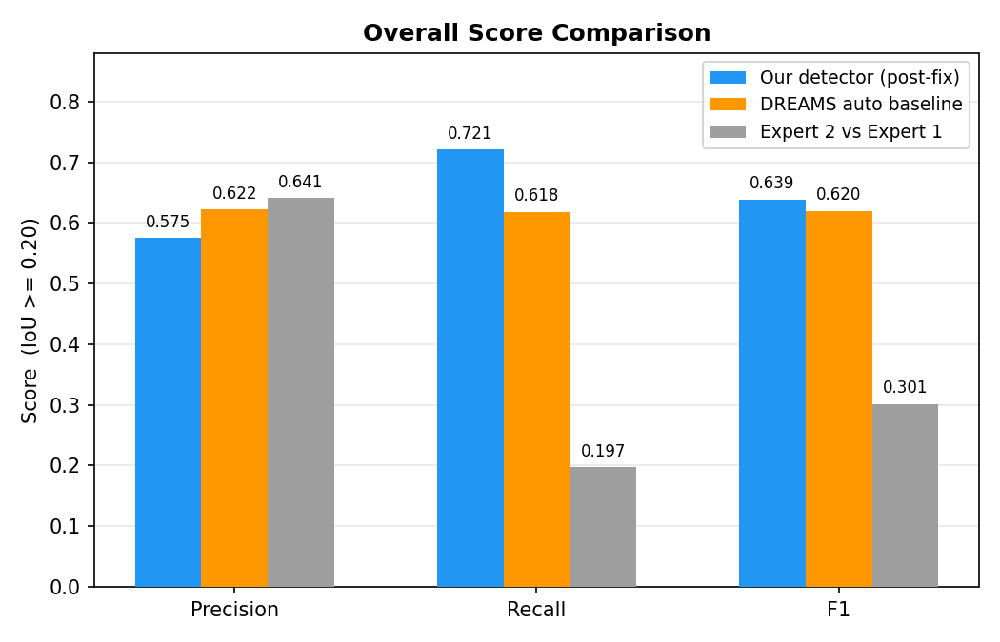
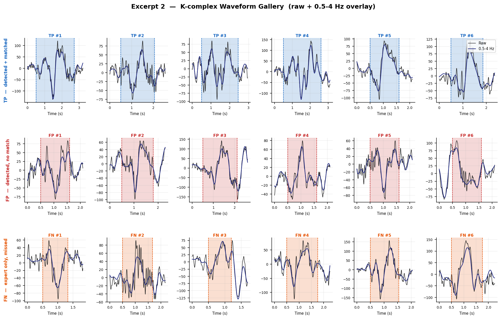
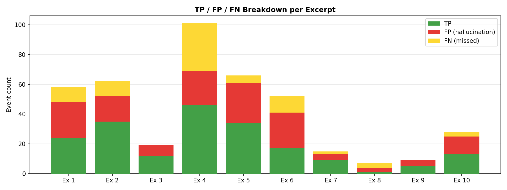
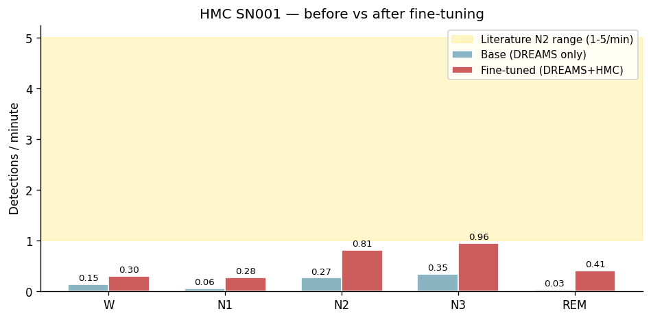

# K-Complex Detector

Machine-learning detection of **K-complexes** in single-channel sleep EEG,
validated on the **DREAMS** database and stress-tested for cross-dataset
generalization on **HMC**.

This is one of two side-by-side projects in this repository. The other,
[`neural-mass-model`](../neural-mass-model), is the EEG *simulator* and is fully
independent of this one.

---

## Installation

```bash
cd kcomplex-detector
pip install -e ".[dev]"     # dev extra adds pytest, matplotlib, mne
```

`mne` is only needed to load the HMC EDF files; the core detector and the unit
tests do not require it.

## Quick start

```python
from kcomplex_detector import KComplexDetector

detector = KComplexDetector()
detector.fit(train_signals, train_expert_events)   # list of 1-D EEG + event dicts
events = detector.predict(test_signal)              # detected K-complex events
print(detector.score(test_signal, expert_events)["f1"])
```

## How it works (pipeline)

```
raw EEG
  1. candidate windows   loose delta-burst + rule-based detector (high recall)
  2. feature extraction  48 features per window (amplitude, slope, spectral,
                         Teager energy, rolling background z-score, context...)
  3. classifier          HistGradientBoostingClassifier (balanced)
  4. threshold           chosen per fold by inner CV using F-beta (beta=2)
  5. rule gates          zero-crossing, template correlation, alpha-context
  6. merge / pad / filter duration + merging of adjacent detections
  7. spindle rejection   drop windows dominated by sigma-band spindle activity
detected K-complexes
```

---

## Dataset 1 — DREAMS (validated, labelled)

| | |
|---|---|
| Recordings | 10 × 30-min PSG excerpts |
| Channel | CZ-A1 |
| Sampling rate | 200 Hz |
| Labels | Expert 1 (all) + Expert 2 (excerpts 1–5) |

**Evaluation method — Leave-One-Out Cross-Validation.** For each of the 10
excerpts: train on the other 9, choose the decision threshold by *inner* LOO-CV
on those 9 (no information from the held-out excerpt), then score the held-out
excerpt with IoU ≥ 0.20 event matching. Scoring is always against Expert 1, to
match published baselines.

**Training-label strategy**

| Excerpts | Labels used for training |
|---|---|
| 1–5 | Expert 1 ∪ Expert 2 (union) |
| 6–10 | Expert 1 + self-training pseudo-labels (model trained on 1–5, prob ≥ 0.82) |

**Results (latest LOO-CV run)**

```
F1 = 0.632   Precision = 0.531   Recall = 0.779
TP = 212     FP = 187           FN = 60
F1 95% CI (bootstrap) = [0.552, 0.686]

Reference points
  DREAMS published auto-detector ...... F1 = 0.620   (we beat it)
  Inter-rater ceiling (Expert2 vs 1) .. F1 = 0.301   (we are >2x this)
```

The inter-rater F1 of 0.301 is the agreement between the two *human* experts —
it is the practical ceiling for this task. A detector scoring 0.632 against one
expert is therefore agreeing with that expert far more than the two experts
agree with each other.

**How it compares**



*Our detector vs the published DREAMS auto-detector and the human inter-rater
ceiling. (Figures are from a representative run; exact numbers vary slightly
between runs.)*

**Real detections — true / false positives and misses**

Per Jean's advice, here are actual waveforms, not just metrics. Top row: true
positives (matched to an expert). Middle row: false positives (the detector
fired but no expert mark). Bottom row: false negatives (expert-marked
K-complexes the detector missed.)





**Run it**

```bash
python -m benchmarks.dreams_window_detector                  # full LOO-CV
python -m benchmarks.dreams_window_detector --threshold 0.50 # fixed threshold
python -m benchmarks.dreams_window_detector --no-expert2-union
```

---

## Dataset 2 — HMC (cross-dataset, NO K-complex labels)

| | |
|---|---|
| Recording | 1 subject (SN001), full night |
| Duration | 427.5 min |
| Channel | C4-M1 |
| Sampling rate | 256 Hz |
| Labels | Sleep stages only — **no K-complex annotations** |

HMC is a **generalization check**, not a validation set. It has no K-complex
ground truth, and a different channel (C4-M1 vs DREAMS' CZ-A1) and sampling
rate. So we cannot compute precision/recall here. Instead we ask a weaker but
honest question: *does the detector fire at a physiologically plausible rate, in
the right sleep stage (N2)?*

**Pseudo-label fine-tuning.** Because there are no labels, we adapt the
DREAMS-trained model with self-training: run it over HMC, treat high-confidence
N2 detections (prob ≥ 0.20) as pseudo-positives and Wake/REM windows as
pseudo-negatives, and fine-tune on those.

**Before / after**

| | N2 K-complex rate |
|---|---|
| Literature expectation | ~1.0–5.0 / min |
| Base DREAMS model on HMC | 0.27 / min (too low) |
| After pseudo-label fine-tuning | **1.08 / min** (in range) |

This brought the N2 rate into the expected range. The trade-off is somewhat
elevated firing in other stages and a small DREAMS regression on a non-rigorous
fixed-threshold check — expected under cross-channel domain shift. **Treat HMC
results as plausible, not validated.**



**Run it**

```bash
python -m benchmarks.hmc_window_detector                     # base model, full night
python -m benchmarks.hmc_finetune                            # pseudo-label fine-tune (pos>=0.20)
python -m benchmarks.hmc_finetune --pos-threshold 0.30       # alternative threshold
```

---

## DREAMS vs HMC — the key difference

| | DREAMS | HMC |
|---|---|---|
| K-complex labels | Yes (2 experts) | **No** |
| Role | Validation | Generalization check |
| Channel / rate | CZ-A1 / 200 Hz | C4-M1 / 256 Hz |
| Metrics | Precision / Recall / F1 | Event rate per stage only |
| Verdict | **Validated, good** | **Plausible, unverifiable** |

## Repository layout

```
kcomplex-detector/
├── kcomplex_detector/        the package
│   ├── detector.py           KComplexDetector / SpindleDetector (sklearn-style)
│   ├── kcomplex_window_detector.py   window classifier + thresholding
│   ├── kcomplex_features.py  candidate generation + 48-feature extraction
│   ├── event_detection.py    low-level rule-based event detection
│   ├── clinical.py           SO–spindle coupling, thalamic gating
│   └── utils/                dreams_io, event_scoring, preprocessing, data_loader
├── benchmarks/               DREAMS + HMC runnable benchmarks
├── scripts/                  figure-generation scripts
├── tests/                    unit tests
└── figures/                  saved result plots (plots_dreams, plots_hmc)
```

## Data

The DREAMS and HMC raw files are **not** committed (large). Place them under a
`data/` folder at the repository root and pass `--folder` to the benchmarks, or
keep the default paths (`data/dreams/DatabaseKcomplexes`, `data/hmc/...`).

## Running tests

```bash
pytest tests/ -q
```

## Things still to do

- Add visual galleries of true/false positives and negatives (per Jean's advice:
  show real examples, not just metrics).
- Extend HMC evaluation if/when K-complex annotations become available.
- Multichannel detection (K-complexes appear on all electrodes, slightly
  stronger frontally).
