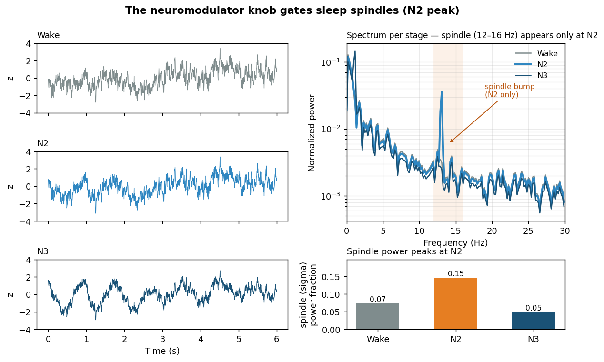

# Neural Mass Model

Neural mass models for **simulating sleep EEG** and **fitting model parameters**
to target signals with Optuna.

This is one of two side-by-side projects in this repository. The other,
[`kcomplex-detector`](../kcomplex-detector), is the ML K-complex detector and is
fully independent of this one.

---

## Installation

```bash
cd neural-mass-model
pip install -e ".[dev]"     # dev extra adds pytest, matplotlib
```

## Quick start

```python
from neural_mass import ThalamocorticalSleepModel

model = ThalamocorticalSleepModel(neuromodulator_level=1.0, seed=7)
signals = model.simulate(seconds=30.0)     # NREM-like EEG

from neural_mass import JansenRitModel
jr = JansenRitModel()
jr.fit(target_eeg, n_trials=100)           # Optuna parameter search
print(jr.A_, jr.B_)
```


*The thalamocortical model fitted to a real sleep-EEG segment (DREAMS, CZ-A1).
Left: a real EEG snippet next to the model's best-fit output. Right: their power
spectra (log scale). The model reproduces the delta-dominant 1/f profile and the
spindle bump, and tracks the spectrum across the full 0.5–30 Hz range — including
the flat ~10⁻⁵ high-frequency floor of real EEG. Two physically-motivated
observation stages make this possible: an **observation low-pass** (synaptic /
volume-conduction filtering) that removes the white-noise-driven high-beta excess
the bare ODE over-produces, and a small **white measurement-noise floor**
(electrode / EMG) that supplies the flat high-frequency floor the low-pass would
otherwise leave empty. The fit is performed in the log-power domain so every band
is matched on the same dB footing the plot shows. Generated by
`scripts/plot_fit_vs_target.py` using `fit_thalamocortical_spectral`.*

## Models

- **Jansen-Rit** — classic two-population cortical oscillator (parameters A, B).
- **Thalamocortical sleep model** — compact multi-state model with a
  `neuromodulator_level` knob that moves the output across sleep stages and
  produces grapho-elements (spindles, K-complex-like transients).
- **Spatiotemporal thalamocortical** — spatial extension of the above.

## Sleep stages: the neuromodulator knob gates spindles



*One calibrated parameter set, three sleep stages set by the `neuromodulator_level`
knob (Wake → N2 → N3). The spectra overlap **except** the 12–16 Hz spindle bump,
which appears **only at N2** — reproducing the known non-monotone relationship
where sleep spindles peak in N2. Spindle (sigma) power: 0.07 (Wake) → 0.15 (N2) →
0.05 (N3). Generated by `scripts/calibrate_stages.py`.*

> **Honest scope.** This compact model has only two oscillators (a slow ~1 Hz
> cortical rhythm and a ~13 Hz spindle), so spindle gating is reproduced cleanly,
> but it is structurally delta-dominant in every stage and **does not** reproduce
> the full Wake→N3 delta deepening (that would need an additional mechanism such
> as a stage-dependent aperiodic slope). It also has no alpha generator.

## Parameter fitting and the choice of objective function

The fitting routines deliberately use **different objective functions** matched
to what is being fit:

| Routine | Objective | Why |
|---|---|---|
| `JansenRitModel.fit` | plain RMSE vs target signal | Only 2 params; goal is to reproduce the raw waveform directly. |
| `fit_thalamocortical_features` | normalized-feature MSE | Features (power, counts, ratios) live on very different scales; normalizing stops the largest-magnitude feature from dominating. |
| `fit_thalamocortical_waveform` | standardized-waveform MSE, sign-invariant | The model has no fixed polarity, so we z-score and take `min(direct, flipped)` error to avoid penalizing a correct-but-inverted solution. |
| `fit_thalamocortical_multi_objective` | 3 separate objectives (spectral cosine, statistical, grapho-element) | Keeps competing physiological criteria as a Pareto front instead of merging them with arbitrary weights; the final pick uses L1 compromise programming. |
| `fit_thalamocortical_spectral` | **log-domain** fine-band profile (L2) over delta…beta2 | Directly enforces the delta-dominant broadband spectral *shape* of real sleep EEG. The multi-objective fit's spectral term is easily out-voted by the stats/grapho terms, which made it collapse onto the spindle band; this routine fixes that (and discards a burn-in so the startup transient doesn't pollute the spectrum). Matching in the **log** domain gives the low-amplitude high-beta bands equal weight to delta (a linear loss is swamped by delta and ignores the tail). It also fits two observation stages — an **observation low-pass** (`eeg_lowpass_hz`, synaptic/volume-conduction filtering) that removes the white-noise-driven >16 Hz excess, and a **white measurement-noise floor** (`measurement_noise_std`, electrode/EMG) that supplies the flat high-frequency floor real EEG shows. |

The common thread: the loss is chosen to match the thing being compared (raw
signal → RMSE; heterogeneous features → normalization; ambiguous polarity →
sign-invariance; competing properties → multi-objective).

## Repository layout

```
neural-mass-model/
├── neural_mass/              the package
│   ├── models/               jansen-rit, thalamocortical, spatiotemporal, graph
│   ├── inference/            inference.py, thalamocortical_fitting.py (Optuna)
│   ├── signal/               vendored event-detection primitives (see note)
│   └── utils/                metrics, preprocessing
├── examples/                 runnable demos
└── tests/                    unit tests
```

> **Why two similarly-named folders?** The outer `neural-mass-model/` (hyphen) is
> the *project* folder — it holds the code plus `pyproject.toml`, `README`, and
> `tests/`. The inner `neural_mass/` (underscore) is the importable Python
> *package* — what you get with `import neural_mass`. This is the standard Python
> layout (e.g. the `scikit-learn` project contains the `sklearn` package).
> Package names can't contain hyphens, hence the hyphen/underscore split.

**Note on `signal/`** — the fitting code measures spindle/K-complex *rates* in
its own simulated output to match observed grapho-element rates. The low-level
event-detection routines it needs are vendored here as a small self-contained
copy, so this project does not depend on the `kcomplex-detector` project.

## Running tests

```bash
pytest tests/ -q
```

## Notes / TODO

See [NOTES.md](NOTES.md). Possible future directions (suggested by the project
guide): fit literature default parameters, match spindle-production rate to
observed rate, and multichannel fitting (one spectral objective per electrode
sharing thalamic parameters).
